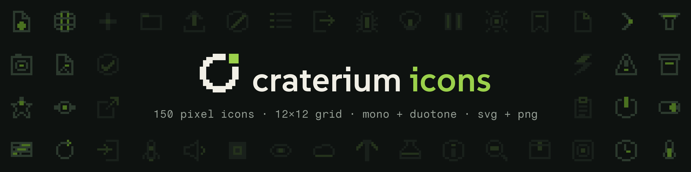

<p align="center">
  
</p>

Pixel icons for [Craterium](https://github.com/Craterium) on a 12 × 12 grid.
Every icon comes in **mono** and **duotone**, as **SVG** and **PNG**.

| category | what's in it | icons |
| --- | --- | --- |
| `panel` | servers, players, console, backups, metrics | 41 |
| `ui` | arrows, actions, status, controls | 77 |
| `dev` | files, git, code, devices | 32 |

Open `preview.html` to browse them all.

## Usage

```html
<span class="crt-icon" aria-hidden="true"><!-- paste svg/duotone/server.svg --></span>
```

```css
:root { --crt-accent: #9BD14B; }
.crt-icon svg { width: 24px; height: 24px; display: block; }
```

- `svg/mono/`: one color, follows `currentColor`
- `svg/duotone/`: `currentColor` plus `var(--crt-accent)`
- `svg/sprite-mono.svg`, `svg/sprite-duotone.svg`: `<use href="sprite-duotone.svg#crt-server"/>`
- `png/<on-dark|on-light>/<mono|duotone>/<12|48|96>/`: fixed brand colors
- `icons.json`: names, categories and tags

Render at multiples of 12 px only (12, 24, 36, 48, 96). Scale PNGs with
`image-rendering: pixelated`.

## Building

Needs Python 3 and `make`. No other dependencies, except Pillow for the banner.

```sh
make                          # check + build everything
make new CAT=ui NAME=thing    # start a new icon
make help
```

`src/<category>/<name>.txt` is the source of truth. Everything else is
generated. The drawing rules are in [ICON_GUIDELINES.txt](ICON_GUIDELINES.txt).

## License

[CC BY-SA 4.0](https://creativecommons.org/licenses/by-sa/4.0/) with one
extra permission. See [LICENSE](LICENSE).

- **Using the icons unmodified** in an app, website, document or product is
  free and needs no attribution. It doesn't put your project under CC BY-SA.
- **Redistributing them as a set or pack**, or **modifying them** and sharing
  the result, needs attribution, and the result has to be CC BY-SA 4.0 too:

  > "Craterium Icons" by Arne K., https://github.com/Craterium/icons, CC BY-SA 4.0

The license doesn't cover the Craterium name or logo. The bundled fonts in
`tools/fonts/` are under the SIL Open Font License.
